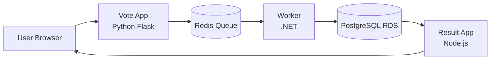
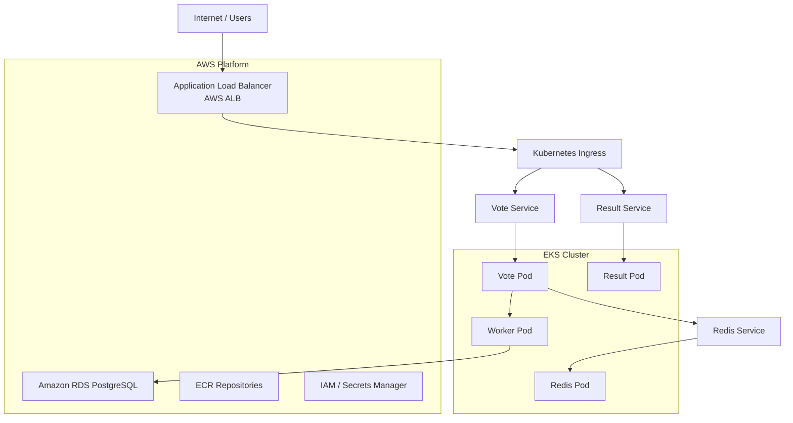
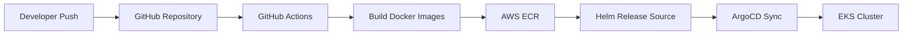

# Voting App DevOps

A production-grade DevOps portfolio project built on top of the Docker Samples voting app, deployed on AWS EKS with Terraform, Kubernetes, Helm, ArgoCD, GitHub Actions, Prometheus, and Grafana.

## Project Objective

This project demonstrates a complete cloud-native DevOps workflow around a real microservices application. The focus is not on modifying the application itself, but on building the platform layer around it: infrastructure provisioning, deployment automation, GitOps, monitoring, and operational visibility.

The goal is to build a portfolio project that looks production-grade and signals strong DevOps capability to recruiters and hiring managers targeting backend, cloud, and platform engineering roles.

---

## Application Overview

The application is a classic vote-processing system with five services:

- vote — Python Flask frontend
- result — Node.js results dashboard
- worker — .NET consumer that processes messages
- redis — message queue
- postgres — persistent storage for results

This project preserves the original application behavior and focuses on the infrastructure and delivery layer around it.

---

## Architecture

### Runtime flow



### Kubernetes + AWS architecture



### CI/CD and GitOps flow



---

## Tech Stack

### Application stack
- Python Flask
- Node.js
- .NET
- Redis
- PostgreSQL

### Cloud infrastructure
- Amazon EKS
- Amazon VPC
- Amazon RDS
- Amazon ECR
- Amazon ALB
- IAM
- Secrets Manager
- CloudWatch-ready observability

### DevOps stack
- Terraform
- Helm
- Kubernetes manifests
- ArgoCD
- GitHub Actions
- Prometheus
- Grafana
- Docker Compose

---

## Repository Structure

```text
voting-app-devops/
├── .github/
│   └── workflows/
├── argocd/
│   ├── application.yaml
│   ├── project.yaml
│   └── applications/
├── helm/
│   ├── Chart.yaml
│   ├── values.yaml
│   ├── values-dev.yaml
│   ├── values-prod.yaml
│   └── templates/
├── k8s/
│   ├── namespace.yaml
│   ├── apps/
│   ├── ingress/
│   └── shared/
├── monitoring/
│   ├── README.md
│   ├── grafana/
│   └── prometheus/
├── terraform/
│   ├── providers.tf
│   ├── variables.tf
│   ├── vpc.tf
│   ├── eks.tf
│   ├── ecr.tf
│   ├── rds.tf
│   ├── alb.tf
│   ├── outputs.tf
│   ├── backend.tf
│   ├── terraform.tfvars
│   └── README.md
├── result/
├── vote/
├── worker/
├── docker-compose.yml
├── docker-stack.yml
├── README.md
├── LICENSE
└── .gitignore
```

---

## Deployment Workflow

### 1. Local development

```bash
docker compose up
```

Access the app locally:
- Vote app: [http://localhost:8080](http://localhost:8080)
- Result app: [http://localhost:8081](http://localhost:8081)

The local stack runs the complete application path: the vote service publishes
messages to Redis, the worker persists results to PostgreSQL, and the result
service reads the stored totals.

Useful local validation commands:

```bash
docker compose up -d --build
docker compose ps
docker compose logs --tail=100 worker
docker compose down
```

### 2. Kubernetes deployment

```bash
kubectl apply -R -f k8s/
```

### 3. Helm deployment

```bash
helm upgrade --install voting ./helm -n voting --create-namespace
```

The repository contains both a reusable Helm chart and explicit Kubernetes
manifests. The active ArgoCD application deploys the `helm/` chart; the
manifests under `k8s/` remain available for direct, explicit Kubernetes
deployment and troubleshooting.

### 4. Terraform infrastructure deployment

```bash
cd terraform
terraform init
terraform plan
terraform apply
```

### 5. GitOps sync via ArgoCD

```bash
kubectl port-forward svc/argocd-server -n argocd 8080:80
```

Then access ArgoCD UI at:
- [http://localhost:8080](http://localhost:8080)

### AWS application URLs

The AWS Application Load Balancer exposes the two user-facing routes below:

- Vote application: `http://<ALB-DNS-NAME>/vote`
- Result application: `http://<ALB-DNS-NAME>/result`

Retrieve the live hostname with:

```bash
kubectl get ingress voting-app-ingress -n voting \
    -o jsonpath='{.status.loadBalancer.ingress[0].hostname}'
```

PowerShell equivalent:

```powershell
$alb = kubectl get ingress voting-app-ingress -n voting -o jsonpath='{.status.loadBalancer.ingress[0].hostname}'
"Vote:   http://$alb/vote"
"Result: http://$alb/result"
```

The `/vote` and `/result` paths are defined in [k8s/ingress/ingress.yaml](k8s/ingress/ingress.yaml).

---

## CI/CD and GitOps

### GitHub Actions workflow
This project includes a pipeline to:
- build application images for vote, result, and worker
- authenticate to AWS using GitHub Actions OIDC
- push immutable commit-tagged images and `latest` tags to Amazon ECR

ArgoCD continuously reconciles the Helm release from the repository. Image
promotion and manifest version updates are separate release controls; a
successful image build alone is not treated as proof of a successful cluster
deployment.

### ArgoCD
ArgoCD is used to maintain the desired state of the Kubernetes application and enables:
- declarative deployment
- automated reconciliation
- sync status visibility
- environment consistency

---

## Observability and Monitoring

The project includes a Prometheus and Grafana-based monitoring stack for Kubernetes and application visibility.

### Prometheus
Prometheus scrapes:
- Kubernetes nodes
- pods
- services
- kube-state-metrics
- node exporter

### Grafana
Grafana is used to visualize:
- pod health
- node health
- CPU and memory usage
- restart patterns
- cluster-level overview

The exported dashboard is stored in
`monitoring/grafana/` so the observability view is reviewable and reproducible
as code.

### Example PromQL queries

```promql
up
kube_pod_info
kube_node_info
kube_pod_status_ready
kube_node_status_condition{condition="Ready"}
sum(rate(container_cpu_usage_seconds_total[5m])) by (pod)
```

---

## Security and Production Readiness

This project incorporates multiple production-oriented practices:
- Infrastructure as Code with Terraform
- Kubernetes resource limits and readiness checks
- Secrets and config separation
- IAM and AWS-native security patterns
- environment-specific Helm values
- remote state management
- cost-aware teardown strategy
- GitOps-based deployment flow

Credentials are intentionally excluded from version control. Kubernetes
database credentials are sourced through External Secrets and AWS Secrets
Manager; local Terraform variable files and state files are ignored by
`.gitignore`.

---

## Cost Strategy

The project is designed to remain cost-efficient:
- local validation where possible
- AWS only for final validation and demos
- infrastructure teardown after screenshots if required
- target total AWS spend kept low for portfolio use

This demonstrates awareness of real-world cloud cost management.

---

## Screenshot Checklist

### Local validation
- Vote app on localhost:8080
  

- Result app on localhost:8081
 

- `docker ps` output
 


### Kubernetes validation
- `kubectl get nodes`
  


- `kubectl get pods -A`
 
 


- 
- ingress output showing the ALB hostname
 `/vote` application URL on AWS
 

- 
 `/result` application URL on AWS
 


### GitOps validation

- ArgoCD sync status
 


- project and application definitions

### Monitoring validation
- Prometheus 
 

---

## Summary

This project demonstrates a complete DevOps workflow end to end:
- infrastructure provisioned as code (Terraform)
- containerized microservices deployed to Kubernetes (EKS)
- automated, path-scoped CI pipelines with OIDC-authenticated image publishing
- GitOps-based continuous delivery via ArgoCD
- externalized secrets management (no credentials in version control)
- cluster and workload observability via Prometheus and Grafana
- cost-aware infrastructure operation

It goes beyond a simple app deployment — the focus throughout is the platform and delivery layer surrounding the application, not the application code itself.

 
---

This project uses production patterns (IaC, GitOps, IRSA, secrets externalization) at portfolio scale and cost. Deliberate simplifications for cost: single NAT gateway (no multi-AZ egress redundancy), single-AZ RDS with short backup retention, no TLS on the ALB yet. In a real production environment these would be multi-AZ, longer retention with deletion protection enabled, and HTTPS-only.

## Future Enhancements

Potential next steps include:
- app-specific dashboards for vote and result services
- alert rules for failure conditions
- TLS and ingress hardening
- multi-environment separation
- advanced autoscaling policies
- more complete security automation

These are deliberate next steps, not prerequisites for the current portfolio
baseline. The current implementation already demonstrates infrastructure as
code, container delivery, Kubernetes operations, GitOps, external secrets, and
cluster observability.

---

## Conclusion

This project reflects a practical, production-style DevOps workflow for a microservices application. It combines infrastructure provisioning, Kubernetes deployment, issue tracking through GitOps, monitoring, and cloud-native operations into one portfolio-ready solution.

The project is suitable for demonstrating strong hands-on capability for DevOps, platform engineering, SRE, and cloud-native roles.
